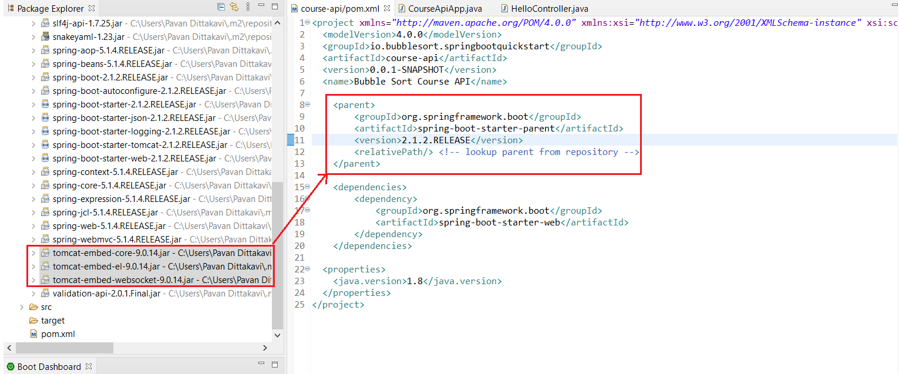

# Introduction
- Spring is a huge framework used for creating standalone Spring based applications easily.
- Spring is an application framework - that does the handling of Http requests, connections to databases ( RDBMS, MongoDB ), running queries etc.
- Sprint Boot is like a wrapper on top of it so that the setting of Spring project, working and managing its dependencies are easy.
- This is extremely useful because most projects have some commonalities like connecting to databases, etc.
- So having this supplied by default via the Spring application using Bootstrap is what Spring Boot does.

# Problems with Spring
1. Huge framework that can be too much for a beginner.
2. Lot of steps involved in setting up a project
3. Configuration steps
4. Multiple build and deploy steps
These steps are abstracted via Sprint Boot.

# Creating a SpringBoot project

Spring applications are typically managed by Maven. You can just create a Maven project and add the following parent/dependency.

  <parent>
	<groupId>org.springframework.boot</groupId>
	<artifactId>spring-boot-starter-parent</artifactId>
	<version>2.1.2.RELEASE</version>
	<relativePath/>
   </parent>

   <dependencies>
	<dependency>
	<groupId>org.springframework.boot</groupId>
	<artifactId>spring-boot-starter-web</artifactId>
	</dependency>
    </dependencies>

The `<parent>` section inherits the configurations defined in that Maven project onto the current project and the `<dependency>` section describes the dependencies needed for the current project to be build successfully. In other words, the dependencies section tells which jars etc are needed and the parent section tells which versions of those jars are going to be used. This preset configuration is referred to as Spring **Bill of Materials**.

The below piece of code lets us launch the bare minimum springboot application.
1. @SpringBootApplication tells Spring that this class is the SpringBoot Application.
2. Recall that SpringBoot helps in building standalone applications - hence the main method.
3. SpringApplication.run() - 
       a. Sets up default configuration.
       b. Starts Spring Application context
       c. Performs class path scan ( annotations @Service, @Controller )
       d. Starts Tomcat server - this comes with SpringBoot. 
 
```java
package io.bubblesort.springbootstarter;

import org.springframework.boot.SpringApplication;
import org.springframework.boot.autoconfigure.SpringBootApplication;

@SpringBootApplication
public class CourseApiApp {

	public static void main(String[] args) {
		SpringApplication.run( CourseApiApp.class, args);
	}
}
```

# URL Mappings and Controllers

@RequestMapping determines which URL is going to hit which method of the class. This mainly works for GET requests by default.

```java
package io.bubblesort.springbootstarter.hello;

import java.util.Arrays;
import java.util.List;

import org.springframework.web.bind.annotation.RequestMapping;
import org.springframework.web.bind.annotation.RestController;

@RestController
public class HelloController {
	
	@RequestMapping("/hello")
	public List<String> sayHi() {
		return Arrays.asList( new String[] { "Java", "is", "awesome" } );
	}
}
```

```javascript
["Java","is","awesome"]
```

Notice that the conversion from Java world to JSON happens implicitly and is taken care of by Spring framework.

# Maven Configuration

`SpringApplication.run()` runs the Tomcat servlet container. This is done programmatically and the relevant Tomcat jar files are loaded into the project via the Maven repository.



Having Tomcat server embedded has the following advantages:
1. Convenience
2. Standalone application
3. Useful for Microservices architecture - no additional steps needed to configure multiple Microservices instances.
4. Servlet container is now part of Application itself and can be configured via Application configuration itself.


